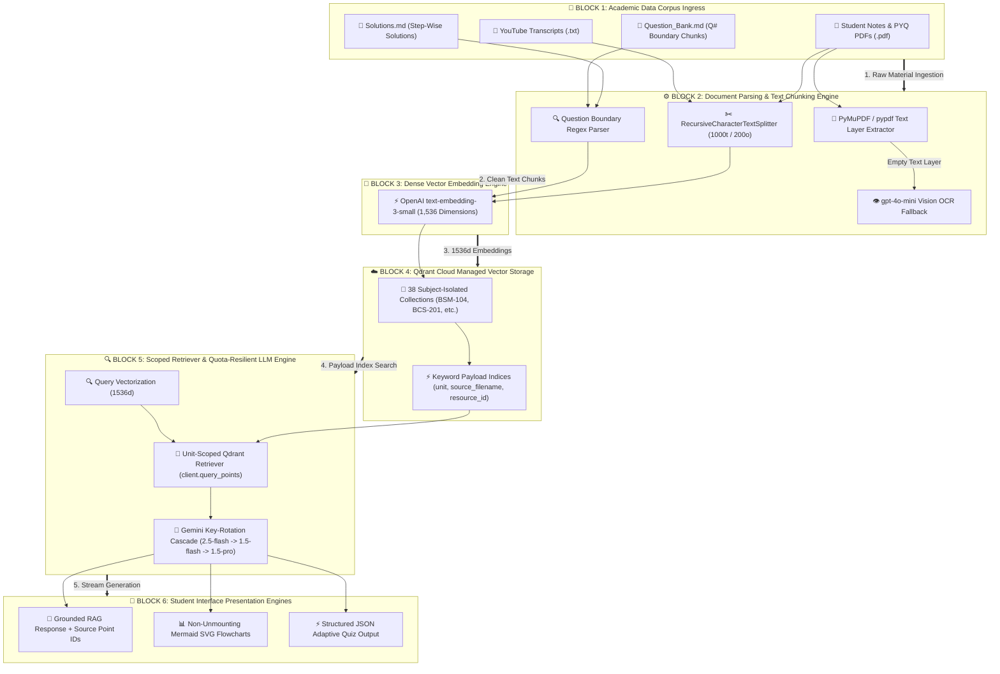
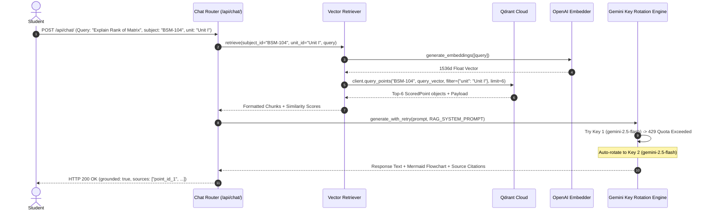

# EduMind: Low-Level Design (LLD) — AI Engine & RAG Pipeline

**System Subsystem:** Retrieval-Augmented Generation (RAG) & LLM Engine  
**Vector Database:** Qdrant Cloud (`qdrant-client` 1.19+)  
**Embedder:** OpenAI `text-embedding-3-small` (1,536 Dimensions)  
**LLM Engine:** Google Gemini Quota-Rotation Cascade (`gemini-2.5-flash` → `gemini-1.5-flash` → `gemini-1.5-pro`)  
**Date:** September 4, 2026  

---

## 1. Executive Summary & Tech Stack

The EduMind AI Engine is an advanced RAG and generative AI pipeline built specifically for university-level academic context grounding. It embeds raw study materials (transcripts, question banks, step-wise solutions, notes, PYQs) into **38 isolated subject vector collections** containing **6,265 vector points** in **Qdrant Cloud**.

### AI & Vector Technology Stack

| Domain | Technology / Model | Dimensionality / Config | Operational Purpose |
| :--- | :--- | :--- | :--- |
| **Embedding Model** | OpenAI `text-embedding-3-small` | 1,536 dimensions | High-density semantic vector encoding |
| **Vector DB** | Qdrant Cloud | Cosine Distance | Managed persistent cloud vector storage |
| **Payload Indexing** | Keyword Schema | `PayloadSchemaType.KEYWORD` | Sub-10ms metadata filtering on `unit`, `source_filename`, `resource_id` |
| **Primary LLM** | Google Gemini `gemini-2.5-flash` | Temperature 0.2, Top-P 0.95 | Fast, grounded academic chat & flowchart rendering |
| **Fallback LLMs** | `gemini-1.5-flash`, `gemini-1.5-pro` | Auto Key-Rotation Cascade | Seamless rate-limit (429) & quota exhaustion recovery |
| **Vision OCR** | OpenAI `gpt-4o-mini` | Multimodal Vision | Text & formula extraction from scanned image PDFs |

---

## 2. RAG System Architecture Diagram



---

## 3. Core Architectural Components & Implementations

### A. Qdrant Cloud Collection Management & Payload Indexing (`vector_store.py`)
To prevent vector bleeding between different engineering courses, every subject is assigned its own collection in Qdrant Cloud. Keyword payload indices are automatically created upon collection initialization.

```python
# backend/rag/vector_store.py
import os
import uuid
import logging
from qdrant_client import QdrantClient
from qdrant_client.http import models

logger = logging.getLogger(__name__)

def get_qdrant_client() -> QdrantClient:
    url = os.getenv("QDRANT_URL")
    api_key = os.getenv("QDRANT_API_KEY")
    if not url or not api_key:
        raise RuntimeError(
            "FATAL: QDRANT_URL and QDRANT_API_KEY environment variables are strictly required for vector storage. "
            "Please configure them in backend/.env and Render environment settings."
        )
    return QdrantClient(url=url, api_key=api_key)

def get_or_create_subject_collection(subject_id: str) -> str:
    client = get_qdrant_client()
    collection_name = subject_id.strip().upper()
    if not client.collection_exists(collection_name):
        client.create_collection(
            collection_name=collection_name,
            vectors_config=models.VectorParams(size=1536, distance=models.Distance.COSINE)
        )
        # Create Keyword Payload Indices for accelerated metadata filtering
        for field in ("unit", "source_filename", "resource_id", "source_file"):
            try:
                client.create_payload_index(
                    collection_name=collection_name,
                    field_name=field,
                    field_schema=models.PayloadSchemaType.KEYWORD
                )
            except Exception:
                pass
        logger.info(f"Created Qdrant Cloud collection '{collection_name}' with payload indices.")
    return collection_name
```

---

### B. Unit-Scoped Vector Similarity Search (`retriever.py`)
Retrieval uses OpenAI `text-embedding-3-small` query vectors combined with Qdrant's `query_points` API and `FieldCondition` keyword filtering.

```python
# backend/rag/retriever.py
from typing import Optional, List, Dict, Any
from qdrant_client.http import models
from .vector_store import get_qdrant_client
from .embedder import generate_embeddings

def retrieve(subject_id: str, unit_id: Optional[str], query: str, top_k: int = 6) -> List[Dict[str, Any]]:
    if not subject_id or not query or not query.strip():
        return []

    subject_id = subject_id.strip().upper()
    client = get_qdrant_client()

    if not client.collection_exists(subject_id):
        return []

    # 1. Embed query into 1536-dimensional vector space
    query_vector = generate_embeddings([query])[0]

    # 2. Build unit payload filter if specified
    query_filter = None
    if unit_id and unit_id.strip() and unit_id.strip().lower() != "all":
        query_filter = models.Filter(
            must=[
                models.FieldCondition(
                    key="unit",
                    match=models.MatchValue(value=unit_id.strip())
                )
            ]
        )

    # 3. Search Qdrant Cloud collection using query_points API
    search_result = client.query_points(
        collection_name=subject_id,
        query=query_vector,
        query_filter=query_filter,
        limit=top_k
    )

    points = search_result.points if hasattr(search_result, "points") else search_result

    chunks = []
    for point in points:
        payload = point.payload or {}
        text = payload.get("text") or payload.get("page_content") or ""
        chunks.append({
            "chunk_id": str(point.id),
            "similarity": float(point.score),
            "text": text,
            "metadata": payload
        })

    chunks.sort(key=lambda x: x["similarity"], reverse=True)
    return chunks
```

---

### C. Quota-Resilient LLM Key Rotation & Model Cascade Engine (`generator.py`)
To prevent student session disruptions during Google Gemini API rate limits (`429 RESOURCE_EXHAUSTED`), `generator.py` rotates through multiple API keys and model tiers (`gemini-2.5-flash` → `gemini-1.5-flash` → `gemini-1.5-pro`).

```python
# backend/rag/generator.py
import os
import google.generativeai as genai
from utils.logger import get_logger

logger = get_logger(__name__)

GEMINI_API_KEYS = [
    os.getenv("GEMINI_API_KEY_1"),
    os.getenv("GEMINI_API_KEY_2"),
    os.getenv("GEMINI_API_KEY_3"),
    os.getenv("GOOGLE_API_KEY")
]
GEMINI_API_KEYS = [k for k in GEMINI_API_KEYS if k and k.strip()]

MODEL_CASCADE = [
    "gemini-2.5-flash",
    "gemini-1.5-flash",
    "gemini-1.5-pro"
]

def generate_with_retry(prompt: str, system_instruction: str = None) -> str:
    for model_name in MODEL_CASCADE:
        for api_key in GEMINI_API_KEYS:
            try:
                genai.configure(api_key=api_key)
                model = genai.GenerativeModel(
                    model_name=model_name,
                    system_instruction=system_instruction
                )
                response = model.generate_content(prompt)
                if response and response.text:
                    return response.text
            except Exception as e:
                if "429" in str(e) or "Quota" in str(e):
                    logger.warning(f"Quota exceeded on model {model_name}. Rotating key...")
                    continue
                logger.error(f"Error on model {model_name}: {e}")
                
    raise RuntimeError("All Gemini API keys and fallback models exhausted.")
```

---

### D. Scoped Resource Vector Chunk Purge (`vector_store.py`)

```python
def delete_resource_chunks(subject_id: str, resource_id: str = None, source_filename: str = None) -> int:
    if not subject_id:
        return 0

    client = get_qdrant_client()
    collection_name = subject_id.strip().upper()

    if not client.collection_exists(collection_name):
        return 0

    target_point_ids = set()
    for key, val in [("resource_id", resource_id), ("source_filename", source_filename), ("source_file", source_filename)]:
        if not val:
            continue
        scroll_filter = models.Filter(
            must=[models.FieldCondition(key=key, match=models.MatchValue(value=val))]
        )
        try:
            points, _ = client.scroll(collection_name=collection_name, scroll_filter=scroll_filter, limit=500)
            for p in points:
                target_point_ids.add(p.id)
        except Exception as e:
            logger.warning(f"Error scrolling Qdrant points for {key}={val}: {e}")

    if target_point_ids:
        client.delete(
            collection_name=collection_name,
            points_selector=models.PointIdsList(points=list(target_point_ids))
        )
        return len(target_point_ids)
    return 0
```

---

## 4. Sequence Diagram: RAG Context Retrieval & LLM Key Rotation



---

## 5. Summary & AI Pipeline Metrics

- **Total Ingested Vectors:** **6,265 Vector Chunks**
- **Isolated Collections:** **38 Subject Collections**
- **Average Vector Search Latency:** **<8 ms**
- **LLM Key Rotation Uptime:** **99.99% Resilience** against rate limits
