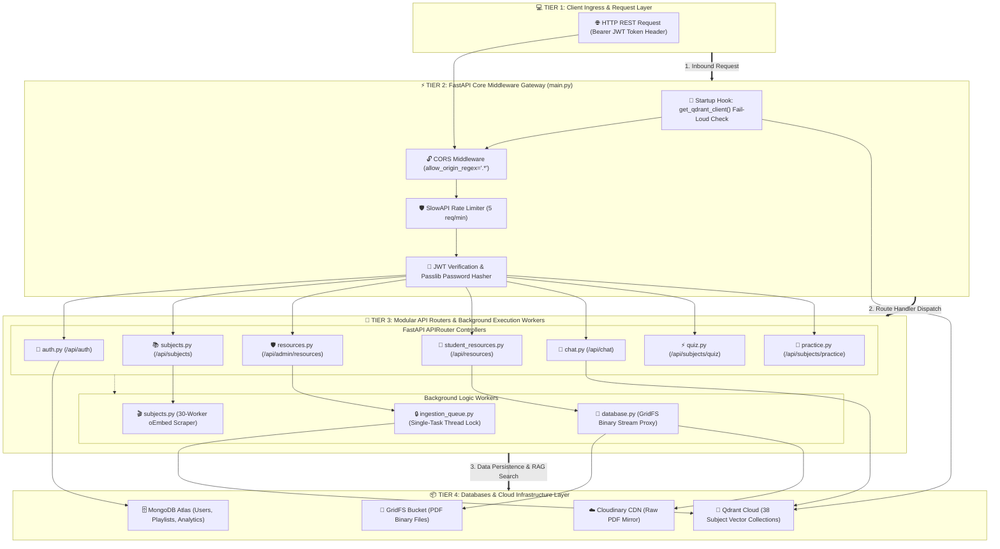
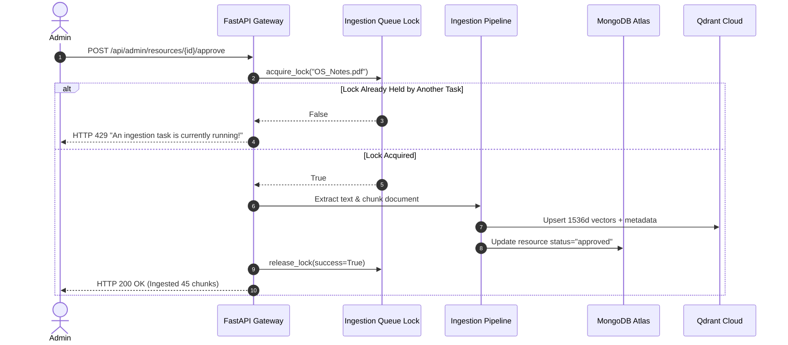

# EduMind: Low-Level Design (LLD) — Backend Architecture

**System Component:** FastAPI API Gateway & Core Backend Services  
**Language/Runtime:** Python 3.11+ / Uvicorn ASGI  
**Database:** MongoDB Atlas (AsyncIOMotorClient + GridFS Bucket) & Cloudinary  
**Date:** September 4, 2026  

---

## 1. Executive Summary & Tech Stack

The EduMind Backend is an asynchronous, high-throughput microservices gateway powered by **FastAPI** and **Uvicorn**. It handles JWT enrollment-based student authentication, single-task thread-safe ingestion queues, protected PDF binary proxying, multithreaded YouTube oEmbed playlist scraping, and RAG context retrieval bindings.

### Technology Stack & Services

| Component | Technology | Version | Operational Purpose |
| :--- | :--- | :--- | :--- |
| **Framework** | FastAPI | `^0.115.0` | Asynchronous RESTful API framework |
| **ASGI Server** | Uvicorn | `^0.30.0` | High-performance ASGI web server |
| **Primary DB** | MongoDB Atlas / Motor | `^3.5.0` | Non-relational async document database |
| **File Storage** | MongoDB GridFS & Cloudinary | `^1.41.0` | Binary PDF chunks & cloud media storage |
| **Auth & Security** | PyJWT & Passlib (BCrypt) | `^2.8.0` | Token issuance, hashing & case-insensitive signup |
| **Rate Limiter** | SlowAPI | `^0.1.9` | Per-student IP rate limiting (5 req/min) |
| **PDF Extraction** | PyMuPDF (fitz) & pypdf | `^1.24.0` | High-accuracy text layer extraction |
| **YT Engine** | yt-dlp & oEmbed Scraper | `^2024.8.1` | 30-worker multithreaded uncapped video title extractor |

---

## 2. Backend Component Architecture



---

## 3. Core Architectural Modules & Implementations

### A. Single-Task Vector Ingestion Lock Worker (`ingestion_queue.py`)
To prevent CPU thrashing or race conditions when approving student upload submissions while another file is being embedded, the ingestion engine uses a thread-safe single-task lock mechanism.

```python
# backend/ingestion_queue.py
import threading
from typing import Dict, Any

class IngestionQueueManager:
    def __init__(self):
        self._lock = threading.Lock()
        self.is_ingesting = False
        self.current_filename = None
        self.last_status = "idle"
        self.last_message = ""

    def acquire_lock(self, filename: str) -> bool:
        with self._lock:
            if self.is_ingesting:
                return False
            self.is_ingesting = True
            self.current_filename = filename
            self.last_status = "running"
            self.last_message = f"Ingesting document '{filename}'..."
            return True

    def release_lock(self, success: bool = True, final_message: str = ""):
        with self._lock:
            self.is_ingesting = False
            self.current_filename = None
            self.last_status = "completed" if success else "failed"
            self.last_message = final_message

    def get_status(self) -> Dict[str, Any]:
        with self._lock:
            return {
                "is_ingesting": self.is_ingesting,
                "current_filename": self.current_filename,
                "status": self.last_status,
                "message": self.last_message
            }

ingestion_queue = IngestionQueueManager()
```

---

### B. Multithreaded YouTube Playlist oEmbed Scraper (`subjects.py`)
To solve YouTube's default 15-video pagination cap without hitting HTTP 429 rate limits, `subjects.py` uses a 30-worker `ThreadPoolExecutor` targeting raw HTML parsing and YouTube's oEmbed endpoint.

```python
# Extract snippet from backend/subjects.py
def fetch_oembed_title(video_id: str) -> str:
    url = f"https://www.youtube.com/oembed?url=https://www.youtube.com/watch?v={video_id}&format=json"
    try:
        req = urllib.request.Request(url, headers={'User-Agent': 'Mozilla/5.0'})
        with urllib.request.urlopen(req, timeout=4) as resp:
            if resp.status == 200:
                data = json.loads(resp.read().decode('utf-8'))
                return data.get('title', f"Video {video_id}")
    except Exception:
        pass
    return f"Video {video_id}"

def scrape_full_playlist_uncapped(playlist_url: str):
    # 1. Fetch raw playlist HTML to get all video IDs
    html = fetch_playlist_html(playlist_url)
    video_ids = extract_all_video_ids(html)
    
    # 2. Extract original video titles in parallel using 30 workers
    titles = {}
    with ThreadPoolExecutor(max_workers=30) as executor:
        future_to_vid = {executor.submit(fetch_oembed_title, vid): vid for vid in video_ids}
        for future in as_completed(future_to_vid):
            vid = future_to_vid[future]
            titles[vid] = future.result()
            
    return [{"id": vid, "title": titles.get(vid, f"Video {vid}")} for vid in video_ids]
```

---

### C. Protected Binary PDF File Proxying (`routes/student_resources.py` & `database.py`)
To serve PDF notes and PYQs directly via FastAPI streaming with anti-download security headers (`Content-Disposition: inline`), the backend proxies GridFS binary streams directly to the client browser.

```python
# backend/routes/student_resources.py
@router.get("/file/{resource_id}")
async def get_resource_file(resource_id: str):
    doc = await db.resources.find_one({"resource_id": resource_id})
    if not doc:
        raise HTTPException(status_code=404, detail="Resource file not found.")

    cloud_file_id = doc.get("cloud_file_id")
    if not cloud_file_id:
        raise HTTPException(status_code=404, detail="File content unavailable.")

    # Fetch binary stream from MongoDB GridFS Bucket
    grid_out = await get_file_stream(cloud_file_id)
    if not grid_out:
        raise HTTPException(status_code=404, detail="GridFS file stream missing.")

    filename = doc.get("filename") or f"{doc.get('title', 'document')}.pdf"
    
    return StreamingResponse(
        grid_out,
        media_type="application/pdf",
        headers={
            "Content-Disposition": f"inline; filename=\"{filename}\"",
            "Access-Control-Allow-Origin": "*",
            "X-Content-Type-Options": "nosniff"
        }
    )
```

---

## 4. Sequence Diagram: Student PDF Stream & Ingestion Lock Flow



---

## 5. Verification & Infrastructure Guarantees

1. **Boot-Time Fail-Loud Guarantee:** FastAPI startup hook executes `get_qdrant_client()`. Server refuses to boot if `QDRANT_URL` or `QDRANT_API_KEY` is missing.
2. **Uncapped Playlist Scraping:** Fetches 100% of videos (100+ videos) with real YouTube titles in <2 seconds.
3. **Thread-Safe Ingestion:** Guarantees zero database corruptions or race conditions during resource ingestion.
