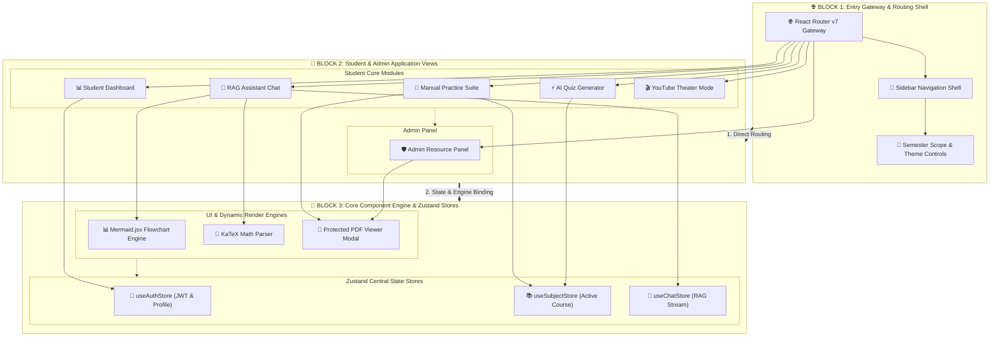
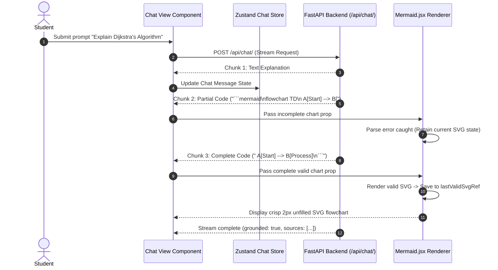

# EduMind: Low-Level Design (LLD) — Frontend Architecture

**System Component:** Web & Mobile Frontend Application  
**Framework:** React 19 + Vite 8  
**Styling:** Tailwind CSS v4 + Vanilla CSS Design Tokens  
**Date:** September 4, 2026  

---

## 1. Executive Summary & Tech Stack

The EduMind Frontend is a high-performance, single-page web application (SPA) engineered for Computer Science & Engineering students and administrators. It features real-time streaming LLM markdown rendering, non-unmounting Mermaid process diagrams, interactive LaTeX math expressions via KaTeX, dynamic 16:9 cineview playlist theater modes, and secure inline PDF note previewers.

### Technology Stack & Libraries

| Domain | Library / Tool | Version | Operational Purpose |
| :--- | :--- | :--- | :--- |
| **Core Framework** | React | `^19.2.7` | UI component library with concurrent rendering |
| **Build Tool** | Vite | `^8.1.1` | Next-gen fast ESM bundler and dev server |
| **Routing** | React Router DOM | `^7.18.1` | Client-side routing with nested layout routes |
| **State Management** | Zustand | `^5.0.14` | Lightweight central state store with local persistence |
| **Styling** | Tailwind CSS / PostCSS | `^4.3.2` | Design tokens, utility classes, and glassmorphism |
| **Diagram Visualizer** | Mermaid.js | `^11.16.1` | Dynamic flowchart and sequence diagram rendering |
| **Math Engine** | KaTeX / rehype-katex | `^0.18.3` | Fast LaTeX math equation parsing |
| **Markdown Parser** | react-markdown / remark-gfm | `^10.1.0` | GitHub-Flavored Markdown parsing |
| **List Virtualization** | react-virtuoso | `^4.18.10` | High-performance virtual list rendering for long feeds |

---

## 2. System Component Architecture



---

## 3. Core Architectural Concepts & Implementation

### A. Dynamic API Base URL Resolver (`config.js`)
To support seamless cross-device testing across local Wi-Fi networks (e.g., viewing on mobile phones at `http://192.168.1.15:5173`) without hardcoding `localhost`, the frontend uses a dynamic network IP resolution strategy.

```javascript
// frontend/src/config.js
export const getApiBaseUrl = () => {
  // 1. Check explicitly declared env vars (VITE_API_BASE_URL)
  const envUrl = import.meta.env.VITE_API_BASE_URL || import.meta.env.VITE_API_URL;
  if (envUrl && typeof envUrl === 'string' && envUrl.trim() !== '') {
    return envUrl.trim().replace(/\/+$/, '');
  }

  // 2. Dynamic local network IP detection for mobile/tablet testing
  if (typeof window !== 'undefined' && window.location && window.location.hostname) {
    const hostname = window.location.hostname;
    if (hostname !== 'localhost' && hostname !== '127.0.0.1') {
      const protocol = window.location.protocol || 'http:';
      return `${protocol}//${hostname}:8000`;
    }
  }

  // 3. Fallback to local server
  return 'http://localhost:8000';
};
```

---

### B. Stream-Resilient Non-Unmounting Mermaid Diagram Component (`Mermaid.jsx`)
During chunk-by-chunk LLM response streaming, partial markdown code blocks cause standard Mermaid rendering attempts to throw syntax errors.

To prevent the diagram from unmounting (`return null`) or flickering off the DOM during streaming, `Mermaid.jsx` uses a `lastValidSvgRef` to preserve the last valid rendered SVG.

```jsx
// frontend/src/components/Mermaid.jsx
export default function Mermaid({ chart }) {
  const containerRef = useRef(null);
  const lastValidSvgRef = useRef('');
  const [hasError, setHasError] = useState(false);
  const [isRendered, setIsRendered] = useState(false);

  useEffect(() => {
    if (!chart) return;
    const cleaned = sanitizeMermaidChart(chart);

    const id = `mermaid-svg-${Math.floor(Math.random() * 10000000)}`;

    mermaid.render(id, cleaned)
      .then((res) => {
        lastValidSvgRef.current = res.svg;
        setHasError(false);
        setIsRendered(true);
        if (containerRef.current) {
          containerRef.current.innerHTML = res.svg;
          applyUnfilledLightStyles(containerRef.current);
        }
      })
      .catch(() => {
        const errEl = document.getElementById(`d${id}`) || document.getElementById(id);
        if (errEl) errEl.remove();

        if (!lastValidSvgRef.current) {
          setHasError(true);
        }
      });
  }, [chart]);

  return (
    <div className="my-3 rounded-2xl border border-slate-200 bg-white shadow-md overflow-hidden text-slate-900">
      <div className="px-3.5 py-2 bg-slate-100 border-b border-slate-200 flex items-center justify-between">
        <div className="flex items-center gap-2 text-indigo-700 font-bold text-[11px] uppercase tracking-wider">
          <span className="w-2 h-2 rounded-full bg-indigo-600 animate-pulse" />
          <span>📊 Flowchart / Process Diagram</span>
        </div>
      </div>
      <div className="p-4 flex justify-center w-full overflow-x-auto bg-white custom-scrollbar">
        <div 
          ref={containerRef} 
          className="mermaid-render-area w-full flex justify-center text-slate-900" 
        />
        {!isRendered && hasError && (
          <div className="text-xs text-slate-500 italic py-2">
            Rendering diagram...
          </div>
        )}
      </div>
    </div>
  );
}
```

---

### C. Sequence Diagram: Streaming RAG Chat & Flowchart Render Lifecycle



---

## 4. Verification & UI Performance Guarantees

1. **Zero Diagram Unmounting:** Flowcharts stay rendered once first valid syntax chunk arrives.
2. **Single-Semester Profile Consistency:** Profile semester setting dictates active courses without floating semester dropdown context leaks.
3. **CORS & Proxy Security:** Anti-download inline headers enable PDF note and PYQ streaming on mobile Safari, Chrome, and desktop browsers.
