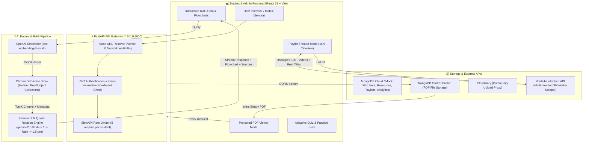

# 🎓 EduMind — AI-Powered Academic Learning Platform

> **EduMind** is a state-of-the-art, AI-driven academic learning management and study assistant platform built specifically for Computer Science & Engineering students. It integrates Retrieval-Augmented Generation (RAG), dynamic YouTube playlist cineview theater modes, protected PDF note streaming, interactive AI study assistants with Mermaid flowcharts & LaTeX math support, adaptive quiz generation, and enrollment-based authentication.

---

## 🚀 Key Highlights & Tech Stack

| Domain | Technology / Tools |
| :--- | :--- |
| **Frontend** | React 19, Vite, Tailwind CSS v4, Zustand, React Router v7 |
| **Markdown & Rendering** | React Markdown, Mermaid.js, KaTeX, rehype-katex, rehype-raw, remark-gfm, remark-math |
| **Backend Framework** | Python 3.11+, FastAPI, Uvicorn, Pydantic v2 |
| **AI LLM Generator** | Google Gemini (`gemini-2.5-flash`, `gemini-1.5-flash`, `gemini-1.5-pro`) with auto quota-rotation cascade |
| **Embedding Model** | OpenAI `text-embedding-3-small` (1536 dimensions) |
| **Vector Store** | ChromaDB (Per-subject collection structural isolation) |
| **Database & File Store** | MongoDB (AsyncIOMotorClient + GridFS Bucket) & Cloudinary |
| **Authentication & Security** | PyJWT (JSON Web Tokens), BCrypt password hashing, SlowAPI rate-limiting |

---

## 🏛️ System Architecture

The following diagram illustrates the end-to-end request lifecycle, AI RAG vector pipeline, media streaming, and multi-tier database fallback system in EduMind:



---

## 🛠️ AI Models & Tools Breakdown

### 1. 🧠 Generation Models (Google Gemini Cascade)
- **Primary Model**: `gemini-2.5-flash` / `gemini-1.5-flash`
- **Fallback Models**: `gemini-1.5-pro`, `gemini-2.0-flash-exp`
- **Quota-Rotation Resilience**: The backend generator contains an automated model fallback cascade. When Google Gemini API emits a `429 RESOURCE_EXHAUSTED` or rate-limit exception, the engine instantly rotates API keys and cascades to fallback models without interrupting the user session.
- **Structured JSON Mode**: Quiz generation uses native Gemini schema constraints (`response_mime_type: "application/json"`) to guarantee strict output structures without hallucinated JSON syntax.

### 2. 🔍 Vector Embeddings (OpenAI `text-embedding-3-small`)
- **Dimensions**: 1536 float embeddings per chunk.
- **Batch Processing**: Embedded using 2048-input parallel batching for high throughput and zero-latency retrieval.
- **Structural Collection Isolation**: Every subject (e.g. `BCS-401`, `BCS-303`) is assigned its own dedicated ChromaDB collection. Context bleeding between subjects is structurally impossible.

### 3. 🎥 YouTube Scraper & Theater Engine
- **Multithreaded Scraper**: Uses raw HTML parsing combined with a 30-worker `ThreadPoolExecutor` targeting YouTube's oEmbed endpoint.
- **Uncapped Playlist Retrieval**: Solves YouTube's default 15-video pagination cap, fetching **100% of all videos (70+, 100+ videos)** in a playlist with 100% real original YouTube titles and thumbnails.

### 4. 📄 Protected PDF Streaming & Proxy
- **GridFS & Cloudinary Proxy**: Serves PDF notes and PYQs directly via FastAPI streaming with anti-download security headers (`Content-Disposition: inline`, `X-Content-Type-Options: nosniff`).
- **CORS & Mobile Webview Fallback**: Includes explicit `Access-Control-Allow-Origin: *` headers and a fallback direct viewer tab for mobile Safari/Chrome compatibility.

---

## ⭐ Key Features

### 🎬 Interactive Playlist Theater Mode
- **16:9 Cineview Layout**: Cinema-style video player with 1-click preset sizes (*Cineview*, *Standard*, *Wide Study*).
- **Mobile Responsive Design**: Video stays 100% visible at the top of mobile screens with an `aspect-video` ratio while tracklists and AI concepts stack below.
- **1-Click AI Video Summarizer**: Generates instant structured executive summaries of active lecture videos.
- **Live Tracklist Navigation**: Real-time YouTube title tracklist allowing seamless switching across lectures.

### 🤖 RAG Subject AI Study Assistant
- **Grounded Learning**: Answers questions using uploaded course notes, syllabus question banks, and lecture transcripts.
- **Diagram Generation**: Generates native interactive **Mermaid.js** flowcharts, architectural diagrams, and mind maps inside chat responses.
- **LaTeX Math Support**: Renders inline `\(...\)` and block `$$...$$` mathematical equations using **KaTeX**.
- **Source Citations**: Returns exact grounded source file references for verification.

### 📝 Adaptive Quiz Generator & Analytics
- **Subject & Unit-Scoped Quizzes**: Generates instant 5-question or 10-question multiple-choice quizzes tailored to specific syllabus units.
- **Idempotent Submission Policy**: Quiz submissions are strictly non-retake to preserve student performance analytics.
- **Performance Dashboard**: Real-time graphical visualization of subject accuracy, completed quizzes, and unit strength metrics.

### 🔒 Enrollment Security & Recovery System
- **Case-Insensitive Enrollment Matching**: Converts enrollment numbers to uppercase (`.upper()`), preventing login failures due to casing variations.
- **OTP Password Reset**: Secure account recovery via separate recovery email ID verified with 6-digit OTP codes.
- **Semester Context Locking**: Student semester is locked to the profile level to preserve syllabus continuity.

---

## 📂 Repository Structure

```
EduMind/
├── backend/
│   ├── main.py                     # FastAPI application entrypoint & middleware
│   ├── database.py                 # MongoDB Motor driver & GridFS / Mock DB handler
│   ├── jwt_utils.py                # JWT authentication & password hashing
│   ├── limiter.py                  # SlowAPI rate limiting configuration
│   ├── rag/
│   │   ├── embedder.py             # OpenAI text-embedding-3-small embedder
│   │   ├── vector_store.py         # ChromaDB client & subject collection management
│   │   ├── retriever.py            # Cosine similarity retrieval with unit filters
│   │   ├── generator.py            # Gemini LLM streaming & flowchart generator
│   │   ├── prompts.py              # System prompts & grounding refusal rules
│   │   └── quiz_schema.py          # Structured Pydantic quiz JSON schemas
│   ├── routes/
│   │   ├── auth.py                 # Student signup, login, recovery email & OTP reset
│   │   ├── admin_auth.py           # Admin authentication
│   │   ├── student_resources.py    # Public approved resources & YouTube playlist scraper
│   │   ├── resources.py            # Admin resource uploads & student community suggestions
│   │   ├── chat.py                 # RAG AI streaming endpoint & video summarizer
│   │   ├── quiz.py                 # Dynamic quiz generator & submission processor
│   │   └── performance.py          # Student quiz performance metrics
│   ├── data/                       # CSE Syllabus datasets (Transcripts & Question Banks)
│   └── requirements.txt            # Python dependencies
│
└── frontend/
    ├── src/
    │   ├── components/
    │   │   ├── PlaylistTheaterModal.jsx # Mobile-responsive video theater modal
    │   │   ├── PdfViewerModal.jsx       # Protected PDF viewer with CORS fallback
    │   │   ├── Mermaid.jsx              # Mermaid flowchart renderer component
    │   │   ├── LearnTab.jsx             # Notes, PYQs, and Video Playlist view
    │   │   ├── Practice.jsx             # Practice material & manual QA
    │   │   └── QuizGenerator.jsx        # Interactive quiz player
    │   ├── pages/
    │   │   ├── Homepage.jsx             # Main student dashboard
    │   │   ├── Login.jsx                # Student auth page
    │   │   └── AdminDashboard.jsx       # Admin portal & resource ingestion manager
    │   ├── config.js                    # Dynamic multi-network backend URL resolver
    │   └── store/                       # Zustand global application state
    ├── index.css                    # Tailwind CSS v4 styling rules
    └── vite.config.js               # Vite build tool configuration
```

---

## 💻 Local Development Setup

### Prerequisites
- **Node.js**: v18.0 or higher
- **Python**: v3.11 or higher
- **MongoDB**: Local MongoDB server or MongoDB Atlas connection string
- **API Keys**: OpenAI API Key & Google Gemini API Key

---

### 1. Backend Setup

```bash
# Navigate to backend directory
cd backend

# Create and activate virtual environment
python -m venv venv

# On Windows PowerShell:
.\venv\Scripts\Activate.ps1

# On Linux/macOS:
source venv/bin/activate

# Install required dependencies
pip install -r requirements.txt

# Create environment configuration file
cp .env.example .env
```

#### Environment Variables (`backend/.env`)

```env
MONGODB_URI=mongodb+srv://<user>:<password>@cluster.mongodb.net/edumind
USE_MOCK_DB=false

OPENAI_API_KEY=sk-proj-xxxxxxxxxxxxxxxxxxxxxxxx
GEMINI_API_KEY=AIzaSyxxxxxxxxxxxxxxxxxxxxxxxx

JWT_SECRET=super-secret-jwt-key-change-in-production
JWT_ALGORITHM=HS256
ACCESS_TOKEN_EXPIRE_MINUTES=1440

CLOUDINARY_CLOUD_NAME=your_cloud_name
CLOUDINARY_API_KEY=your_api_key
CLOUDINARY_API_SECRET=your_api_secret

SMTP_HOST=smtp.gmail.com
SMTP_PORT=587
SMTP_USER=your_email@gmail.com
SMTP_PASSWORD=your_app_password
```

#### Start FastAPI Backend Server

```bash
python -m uvicorn main:app --host 0.0.0.0 --port 8000 --reload
```

---

### 2. Frontend Setup

```bash
# Navigate to frontend directory
cd ../frontend

# Install dependencies
npm install

# Start Vite dev server
npm run dev
```

The frontend application will be running at `http://localhost:5173`. When accessing from other devices on the same Wi-Fi network, navigate to `http://<your-laptop-ip>:5173`.

---

## ⚡ Deployment Guide

### Vercel (Frontend)
1. Import the repository on [Vercel](https://vercel.com).
2. Set Framework Preset to **Vite**.
3. Add Environment Variable:
   - `VITE_API_BASE_URL`: `https://your-backend-api-domain.com`
4. Deploy!

### Render / Railway / DigitalOcean (Backend)
1. Create a Python Web Service.
2. Build Command: `pip install -r requirements.txt`
3. Start Command: `uvicorn main:app --host 0.0.0.0 --port 8000`
4. Add all keys from `backend/.env`.

---

## 🛡️ License & Acknowledgments

Built for Computer Science & Engineering students. Powered by FastAPI, Google Gemini, OpenAI, and React.
